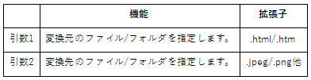

# table2image
基本的なHTMLテーブルを画像化するツールです。EPWING関係で利用します。
## 使い方
``
table2image [変換元ファイル/ディレクトリ] [変換先ファイル/ディレクトリ]
``

このツールは単純なテーブルのみが含まれたhtmlファイルを画像化するツールです。  
使えるのは```<table><tr><td><th>```のみでそれ以外のタグが含まれる場合にはエラーとなる事があります。  
属性指定は<td><th>のalignのみです。

変換元をディレクトリで指定した場合、変換先もディレクトリでなければなりません。  
また変換元がファイルの場合、変換先がファイルかディレクトリかは自動で判定されます。

設定変更は実行ファイルと同じフォルダに置かれているtable2image.iniを書き換えます。  
存在しなければ(正しい引数を指定すれば)実行時に新規に作成されます。
## 利用シーン
EBStudioで辞書を作成する場合に、テーブルが含まれているとあまりきちんとレイアウトされません。  
大量に処理するには画像化するのが最適だったので作成しました。  
必要に応じて簡単に作ったものなので、つくりの甘い所はたくさんあります。  
また関係するスクリプトに関しては別途公開します。
## サンプル
実行結果はこんな感じです。普通です。  

## ライセンス
MITライセンスです。  
自分のツールキットに添付したり、改良したり、使ってくれればうれしいです。
